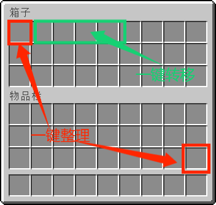

# ContainerSorted


Minecraft 基岩版服务器(BDS) 容器(背包、箱子)整理插件

## 安装

### 使用 Lip

```sh
lip install github.com/LeafKnife/ContainerSorted
```

### 手动安装

1. 从[发布页面](https://github.com/LeafKnife/ContainerSorted/releases)下载最新版本。
2. 解压`ContainerSorted-windows-x64.zip`文件。
3. 将`ContainerSorted`文件夹复制到 BDS 安装目录下的 plugins 文件夹中。

## 使用

使用指定物品(木棍), 点击容器(箱子、末影箱、潜影盒、木桶、船箱、运输矿车)指定格子，即可自动整理/转移。

- 整理：背包最后一格，容器第一格
- 放入所有物品：容器第二格
- 取出所有物品：容器第三格
- 放入部分物品(容器内已有物品)：容器第四格
- 取出部分物品(背包内已有物品)：容器第五格





## 更新日志

查看 [CHANGELOG](CHANGELOG.md) 文件获取更多信息。

## 贡献

如果您有任何问题，请开启一个 [issue](https://github.com/LeafKnife/ContainerSorted/issues) 来讨论  
欢迎 PR

## 许可

GPL-3.0 © LWenK
